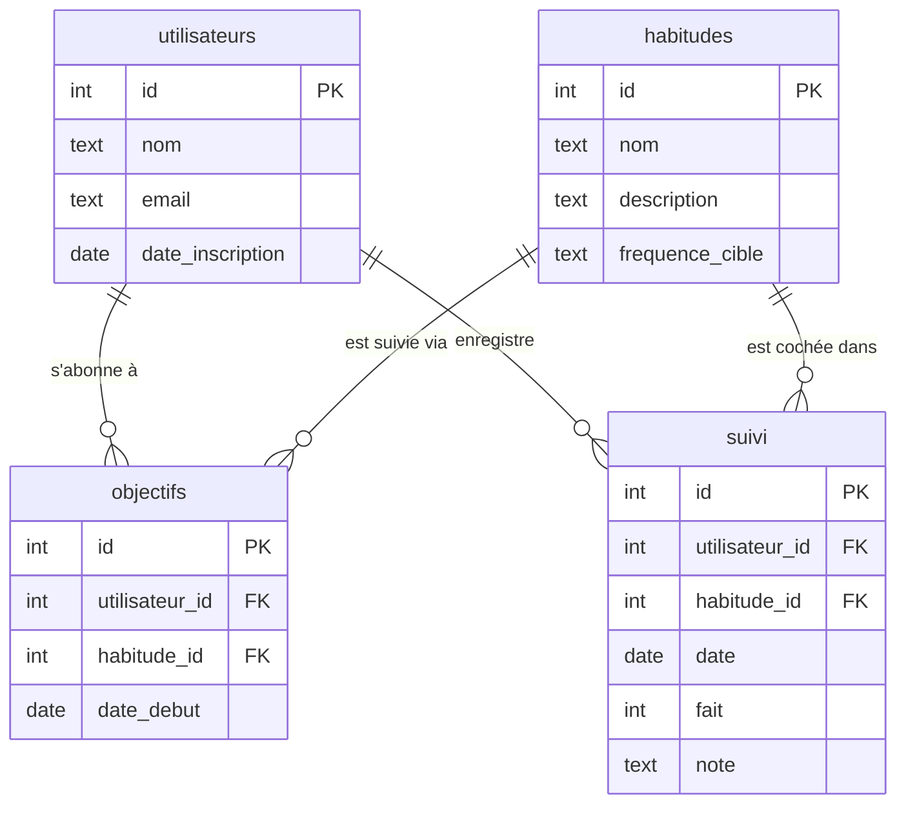

# 🧠 DESIGN — Habit Tracker

## Contexte

Un utilisateur veut suivre plusieurs habitudes quotidiennes. Chaque jour, il coche
les habitudes qu'il a réalisées. L'application calcule ensuite sa régularité.

---

## Entités et attributs

### `utilisateurs`
Représente les personnes qui utilisent l'application.

| Colonne | Type | Contrainte | Description |
|---------|------|------------|-------------|
| id | INTEGER | PK, AUTOINCREMENT | Identifiant unique |
| nom | TEXT | NOT NULL | Prénom ou pseudo de l'utilisateur |
| email | TEXT | NOT NULL, UNIQUE | Email de connexion |
| date_inscription | DATE | NOT NULL, DEFAULT aujourd'hui | Date d'arrivée dans l'app |

### `habitudes`
Représente les habitudes disponibles dans le système.

| Colonne | Type | Contrainte | Description |
|---------|------|------------|-------------|
| id | INTEGER | PK, AUTOINCREMENT | Identifiant unique |
| nom | TEXT | NOT NULL | Nom de l'habitude (ex: Sport) |
| description | TEXT | — | Description optionnelle |
| frequence_cible | TEXT | CHECK | Fréquence cible (quotidienne, hebdomadaire) |

### `objectifs`
Lie un utilisateur à une habitude : il "s'abonne" à une habitude avec une date de début.
Cela permet de ne pas afficher une habitude avant que l'utilisateur ne l'ait choisie.

| Colonne | Type | Contrainte | Description |
|---------|------|------------|-------------|
| id | INTEGER | PK, AUTOINCREMENT | Identifiant unique |
| utilisateur_id | INTEGER | FK → utilisateurs | L'utilisateur concerné |
| habitude_id | INTEGER | FK → habitudes | L'habitude suivie |
| date_debut | DATE | NOT NULL | Depuis quand l'utilisateur suit cette habitude |

### `suivi`
Enregistre chaque jour si une habitude a été réalisée ou non.
C'est la table centrale de l'application.

| Colonne | Type | Contrainte | Description |
|---------|------|------------|-------------|
| id | INTEGER | PK, AUTOINCREMENT | Identifiant unique |
| utilisateur_id | INTEGER | FK → utilisateurs | L'utilisateur |
| habitude_id | INTEGER | FK → habitudes | L'habitude cochée |
| date | DATE | NOT NULL | Le jour concerné |
| fait | INTEGER | CHECK IN (0,1), DEFAULT 0 | 1 = réalisé, 0 = non réalisé |
| note | TEXT | — | Commentaire libre du jour |

---

## Relations

- Un **utilisateur** peut suivre plusieurs **habitudes** → via `objectifs` (N:M)
- Une **habitude** peut être suivie par plusieurs **utilisateurs**
- Chaque entrée de **suivi** appartient à un utilisateur et concerne une habitude
- La table `objectifs` capture la relation N:M entre utilisateurs et habitudes

---

## Diagramme Entité-Relation

---

## Choix de conception

**Pourquoi une table `objectifs` séparée ?**
Sans elle, on ne saurait pas depuis quand un utilisateur suit une habitude,
ni quelles habitudes il a choisies. La table `suivi` seule ne suffit pas :
un utilisateur pourrait ne pas cocher une habitude un jour sans qu'on sache
s'il la suit ou non.

**Pourquoi `fait` est un INTEGER (0/1) plutôt qu'un BOOLEAN ?**
SQLite n'a pas de type BOOLEAN natif. On utilise 0 et 1, avec un CHECK
pour garantir l'intégrité.

**Pourquoi garder `note` dans `suivi` ?**
Certaines applications permettent d'ajouter un commentaire quotidien
("couru 5 km", "lu 30 pages"). Ce champ optionnel enrichit les données
sans alourdir la structure.

---

## Limitations connues

- Pas de gestion multi-appareils / synchronisation
- Pas de système de rappels ou notifications
- `frequence_cible` est un TEXT libre (pas de validation fine)
- Pas de notion de "streak" (série consécutive) calculée en base — c'est calculé dans les requêtes
